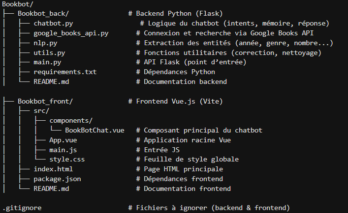

# BookBot
https://bookbot-front.onrender.com/

## Présentation
BookBot est un agent conversationnel développé en Python qui permet aux utilisateurs de recevoir des suggestions personnalisées de livres en français, basées sur :

un thème, un auteur, un genre ou un mot-clé,

une émotion ou ambiance,

des critères comme la note, l’année de publication,

et même des fautes de frappe.

Il s'appuie sur l'API Google Books pour récupérer en temps réel les informations, résumés, auteurs et liens vers les ouvrages.

## Fonctionnement conversationnel
BookBot comprend des requêtes naturelles telles que :

- "Je veux un livre de *Victor Hugo* ?"

- "Je cherche le livre *1984* de George Orwell"

- "Je veux un livre sur l’IA ou la technologie ?"

- "Trouve-moi un livre de développement personnel."

## Fonctionnalités principales
- Recherche par :
    - auteur, titre, thème, ambiance (ex: "livre triste", "effrayant", "romantique")

- Résumé de livre sur demande

- Filtrage par :

    - année minimale ("après 2010")
    - note minimale ("note au-dessus de 4")

- lien Google Books pour chaque résultat

## Limites
    - La pertinence dépend fortement des résultats de l’API Google Books
    
    - Ne fonctionne que pour les livres disponibles en ligne

    - Pas de conversation multi-tour complexe (pas de dialogue profond)

## Architecture


#### Lancer le bot
```bash
    python main.py
```
#### Pour avoir un environnement chatbot 

##### Etape 1 : Créer un environnement virtuel
```bash
    python -m venv bookbot_env
```

##### Etape 2 : Activer l'environnement virtuel
Sur Windows:
```bash
.\bookbot_env\Scripts\activate
```
Sur macOS et Linux:
```bash
source bookbot_env/bin/activate
```
#### Etape 3 : Installer les packages nécessaires
```bash
pip install -r ./requirements.txt
```
#### Etape 4 : Vérifiez les installations
```bash
pip list
```
